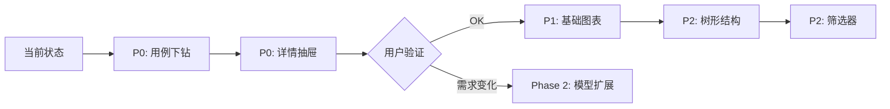

# 基于现有数据模型的 Report 详情页实现方案

## 一、现有数据模型能力分析

### 1.1 可用数据表及字段映射

#### TestExecution (测试执行总览)
**可实现功能**：顶部概览卡片
```python
- report_title          → 报告标题
- total_cases          → 总用例数
- passed/failed/skipped/broken/unknown_cases → 状态分布
- pass_rate            → 通过率
- execution_time       → 执行时长
- start_time/end_time  → 时间范围
- status               → 整体状态
- job (ForeignKey)     → 关联的 Jenkins Job
```

#### TestSuite (测试套件汇总)
**可实现功能**：套件列表 + 套件级统计
```python
- suite_name           → 套件名称
- total_cases          → 该套件的用例总数
- passed/failed/skipped/broken_cases → 状态统计
- pass_rate            → 套件通过率
- duration_seconds     → 套件执行耗时
```

#### TestSuiteDetail (用例详情) ⭐ 核心表
**可实现功能**：用例列表 + 基础详情页
```python
- name                 → 用例名称
- description          → 用例描述
- parent_suite/suite/sub_suite → 三级层级结构
- test_class           → 测试类名
- test_method          → 测试方法名
- status               → 用例状态 (passed/failed/skipped/broken/unknown)
- start_time/stop_time → 执行时间
- duration_in_ms       → 耗时(毫秒)
```

#### Category (缺陷分类)
**可实现功能**：缺陷分类统计
```python
- category_name        → 分类名称
- count                → 该分类下的用例数
- severity             → 严重程度 (critical/major/minor/trivial)
- description          → 分类描述
```

#### FeatureScenario (特性场景)
**可实现功能**：BDD 场景统计
```python
- scenario_name        → 场景名称
- total/passed/failed  → 场景统计
- pass_rate            → 场景通过率
```

### 1.2 数据模型的局限性 ⚠️

**缺失的关键数据**：
1. ❌ **测试步骤 (Steps)**：`TestSuiteDetail` 没有 `steps` 字段
2. ❌ **附件 (Attachments)**：没有截图、日志、视频的存储字段
3. ❌ **参数化数据 (Parameters)**：没有参数表
4. ❌ **历史记录 (History)**：没有跨执行的历史对比表
5. ❌ **错误堆栈 (Stacktrace)**：`description` 字段可能包含，但不是结构化数据

**结论**：当前模型支持 **"统计型报告"**，但不支持 **"调试型报告"**。

---

## 二、基于现有模型的可实现功能清单

### 2.1 ✅ 可以立即实现的功能 (P0)

#### 功能1：概览仪表盘 (Overview Dashboard)
**数据来源**：`TestExecution`
**UI组件**：
- 顶部统计卡片（总数、通过、失败、跳过、中断、未知）
- 通过率大卡片（带颜色区分：绿/黄/红）
- 执行时间信息（开始、结束、耗时）
- 状态徽章（Success/Failed/Running）

**实现难度**：⭐ (已有 70% 实现)

#### 功能2：套件树形列表 (Suite Tree)
**数据来源**：`TestSuite` + `TestSuiteDetail`
**UI组件**：
- 左侧：套件列表（可展开）
- 点击套件 → 右侧显示该套件下的用例列表
- 每个套件显示：名称、通过率、耗时、状态图标

**实现难度**：⭐⭐ (需要新增树形组件)

#### 功能3：用例详情抽屉 (Case Detail Drawer)
**数据来源**：`TestSuiteDetail`
**可展示内容**：
- 用例名称 (`name`)
- 用例描述 (`description`)
- 测试类/方法 (`test_class`, `test_method`)
- 状态 (`status`)
- 执行时间 (`start_time`, `stop_time`)
- 耗时 (`duration_in_ms`)
- 层级路径 (`parent_suite` → `suite` → `sub_suite`)

**实现难度**：⭐⭐ (简单的详情展示)

#### 功能4：缺陷分类视图 (Categories View)
**数据来源**：`Category`
**UI组件**：
- 分类列表（按严重程度排序）
- 每个分类显示：名称、数量、严重程度标签、描述

**实现难度**：⭐ (已有 50% 实现)

#### 功能5：特性场景视图 (Scenarios View)
**数据来源**：`FeatureScenario`
**UI组件**：
- 场景列表
- 每个场景显示：名称、总数、通过/失败数、通过率

**实现难度**：⭐ (已有 40% 实现)

#### 功能6：基础图表 (Basic Charts)
**数据来源**：`TestExecution` + `TestSuite`
**可实现图表**：
- 状态分布饼图 (passed/failed/skipped/broken)
- 套件通过率柱状图
- 执行时间分布图

**实现难度**：⭐⭐ (需要集成 ECharts)

### 2.2 ⚠️ 有限实现的功能 (P1)

#### 功能7：简化版用例筛选
**数据来源**：`TestSuiteDetail.status`
**可实现**：
- 按状态筛选（只看失败/通过/跳过）
- 按套件名称搜索

**局限**：无法按标签、严重程度等高级条件筛选

**实现难度**：⭐⭐

#### 功能8：层级导航 (Hierarchy Navigation)
**数据来源**：`TestSuiteDetail` 的 `parent_suite`, `suite`, `sub_suite`
**可实现**：
- 三级树形结构（Parent Suite → Suite → Test Case）
- 面包屑导航

**局限**：没有 Package 级别的结构

**实现难度**：⭐⭐⭐

### 2.3 ❌ 无法实现的功能 (需要扩展模型)

| 功能 | 缺失数据 | 解决方案 |
|------|---------|---------|
| 测试步骤展示 | `steps` 字段 | 需要新增 `TestStep` 表或在 `description` 中解析 |
| 附件预览 | `attachments` 字段 | 需要新增 `Attachment` 表 + 文件存储 |
| 错误堆栈 | 结构化的 `error` 字段 | 需要在 `TestSuiteDetail` 中新增 `error_message`, `stacktrace` |
| 参数化数据 | `parameters` 字段 | 需要新增 `TestParameter` 表 |
| 历史趋势 | 跨执行的关联 | 需要按 `test_method` 聚合多次执行记录 |
| 重试记录 | `retries` 字段 | 需要新增 `retry_count`, `retry_history` |

---

## 三、推荐实现路线图

### Phase 1: 基础增强 (1-2周)
**目标**：让当前页面从"表格"升级为"可交互的报告"

**任务清单**：
1. ✅ 改造套件列表为树形结构（可展开/折叠）
2. ✅ 点击套件显示该套件下的用例列表
3. ✅ 点击用例弹出详情抽屉（显示现有字段）
4. ✅ 添加基础图表（饼图、柱状图）
5. ✅ 添加状态筛选器（按 passed/failed/skipped 筛选）

**预期效果**：
- 用户可以从套件下钻到用例
- 用户可以看到每个用例的基本信息
- 用户可以通过图表快速了解整体情况


## 不需要实现的功能
### Phase 2: 数据模型扩展 (2-3周)
**目标**：补充调试所需的关键数据

**任务清单**：
1. 🔧 在 `TestSuiteDetail` 中新增字段：
   - `error_message` (TextField): 错误信息
   - `stacktrace` (TextField): 堆栈跟踪
2. 🔧 新增 `Attachment` 表：
   ```python
   class Attachment(models.Model):
       test_case = ForeignKey(TestSuiteDetail)
       file_type = CharField  # image/video/log/json
       file_path = CharField  # 文件路径或URL
       file_name = CharField
       file_size = IntegerField
   ```
3. 🔧 新增 `TestStep` 表（可选）：
   ```python
   class TestStep(models.Model):
       test_case = ForeignKey(TestSuiteDetail)
       step_name = CharField
       step_status = CharField
       step_duration = IntegerField
       step_order = IntegerField
       error_message = TextField
   ```

**预期效果**：
- 用户可以看到失败用例的错误堆栈
- 用户可以查看截图和日志附件

### Phase 3: 高级功能 (3-4周)
**目标**：接近 Allure 的完整体验

**任务清单**：
1. 📊 历史趋势图（需要聚合多次执行的数据）
2. 🔍 高级搜索（支持多条件组合）
3. 🏷️ 标签系统（需要新增 `Label` 表）
4. ⏱️ 时间线视图（甘特图展示并发执行）

---

## 四、当前阶段的 UI 设计方案

### 4.1 页面布局
```
┌─────────────────────────────────────────────────────────┐
│  [← 返回]  自动化测试报告 #20241227-001                  │
├─────────────────────────────────────────────────────────┤
│  概览区 (Overview)                                       │
│  ┌────────┬────────┬────────┬────────┐                  │
│  │ 总数   │ 通过   │ 失败   │ 通过率 │                  │
│  │  100   │  85    │  15    │  85%   │                  │
│  └────────┴────────┴────────┴────────┘                  │
│  开始: 2024-12-27 10:00  结束: 10:15  耗时: 15min       │
├─────────────────────────────────────────────────────────┤
│  Tab 切换                                                │
│  [套件] [分类] [场景] [图表]                             │
│                                                          │
│  ┌─────────────────┬─────────────────────────────────┐  │
│  │ 套件列表        │ 用例列表                        │  │
│  │                 │                                 │  │
│  │ ▼ LoginSuite    │ ✓ test_login_success  1.2s     │  │
│  │   ├─ 10 cases   │ ✗ test_login_fail     0.8s     │  │
│  │   ├─ 8 passed   │ ✓ test_logout         0.5s     │  │
│  │   └─ 2 failed   │ ...                            │  │
│  │                 │                                 │  │
│  │ ▶ PaymentSuite  │ [点击用例查看详情]              │  │
│  │   ├─ 20 cases   │                                 │  │
│  │   └─ 20 passed  │                                 │  │
│  └─────────────────┴─────────────────────────────────┘  │
└─────────────────────────────────────────────────────────┘
```

### 4.2 用例详情抽屉 (Drawer)
```
┌─────────────────────────────────────┐
│  test_login_fail                ✗   │
├─────────────────────────────────────┤
│  基本信息                            │
│  • 测试类: TestLogin                │
│  • 测试方法: test_login_fail        │
│  • 状态: Failed                     │
│  • 耗时: 0.8s                       │
│  • 开始: 10:05:23                   │
│  • 结束: 10:05:24                   │
├─────────────────────────────────────┤
│  描述                                │
│  验证使用错误密码登录时系统的响应    │
├─────────────────────────────────────┤
│  层级路径                            │
│  LoginSuite → UserAuth → LoginTests │
└─────────────────────────────────────┘
```

---

## 五、总结

### 现有模型可以支持的核心价值
1. ✅ **统计分析**：整体通过率、套件级别的健康度
2. ✅ **快速定位**：通过树形结构找到失败的套件和用例
3. ✅ **基础调试**：查看用例名称、类/方法、执行时间

### 现有模型的不足
1. ❌ **深度调试**：无法查看详细的错误堆栈和步骤
2. ❌ **证据链**：无法查看截图、日志等附件
3. ❌ **趋势分析**：无法对比历史执行情况


---

## 六、前端实现优先级（基于现有 Model）

### 6.1 现状评估

#### ✅ 已完成（当前 ReportDetail.vue）
1. **概览仪表盘** - 70% 完成
   - ✅ 顶部统计卡片（总数、通过、失败、通过率）
   - ✅ 执行时间信息（开始、结束、耗时）
   - ✅ 状态徽章
   - ⚠️ 缺少：跳过、中断、未知用例的统计展示

2. **基础表格展示** - 100% 完成
   - ✅ 套件列表（平铺表格）
   - ✅ 缺陷分类列表
   - ✅ 特性场景列表

#### ❌ 未完成（Phase 1 核心功能）
1. **套件树形结构** - 0% 完成
2. **用例列表下钻** - 0% 完成
3. **用例详情抽屉** - 0% 完成
4. **基础图表** - 0% 完成
5. **状态筛选器** - 0% 完成

---

### 6.2 🎯 实现优先级分级

#### **P0 - 核心交互功能** (预计 1-2 天)
**目标**：让用户能从套件下钻到用例，实现基本的“可交互报告”

##### 任务 1：用例列表下钻 ⭐⭐⭐
**为什么优先**：这是最核心的功能，用户需要看到失败的具体用例

**后端 API**：
```
GET /api/test-report/executions/{execution_id}/cases/
Query Params:
  - parent_suite: 按父套件筛选（可选）
  - status: 按状态筛选（可选）

Response:
{
  "code": 200,
  "data": {
    "execution_id": 123,
    "total_count": 50,
    "cases": [
      {
        "id": 1,
        "name": "test_login_success",
        "status": "passed",
        "duration_in_ms": 1200.0,
        "test_class": "TestLogin",
        "test_method": "test_login_success"
      }
    ]
  }
}
```

**实现步骤**：
1. 在套件表格添加“操作”列，增加“查看用例”按钮
2. 点击按钮调用 API：`GET /api/test-report/executions/{execution_id}/cases/?parent_suite={suite_name}`
3. 在右侧或下方展示用例列表（简单表格即可）
4. 用例列表显示：名称、状态、耗时、测试类/方法

**预期效果**：
```
套件列表                    用例列表
LoginSuite [查看用例] ────→    ✓ test_login_success  1.2s
                           ✗ test_login_fail     0.8s
                           ✓ test_logout         0.5s
```

**技术要点**：
- 使用 `el-table` 展示用例列表
- 状态用颜色区分：passed(绿)、failed(红)、skipped(黄)
- 失败用例优先显示（后端已排序）

---

##### 任务 2：用例详情抽屉 ⭐⭐
**为什么优先**：用户需要看到失败用例的详细信息（类名、方法名、耗时）

**数据来源**：`TestSuiteDetail` 模型字段

**实现步骤**：
1. 在用例列表添加点击事件
2. 使用 `el-drawer` 展示用例详情
3. 显示字段：
   - 基本信息：`name`, `status`, `duration_in_ms`
   - 测试定位：`test_class`, `test_method`
   - 时间信息：`start_time`, `stop_time`
   - 层级路径：`parent_suite` → `suite` → `sub_suite`
   - 描述：`description`

**UI 设计**：
```
┌─────────────────────────────────┐
│  test_login_fail                ✗   │
├─────────────────────────────────┤
│  基本信息                            │
│  • 测试类: TestLogin                │
│  • 测试方法: test_login_fail        │
│  • 状态: Failed                     │
│  • 耗时: 0.8s                       │
│  • 开始: 10:05:23                   │
│  • 结束: 10:05:24                   │
├─────────────────────────────────┤
│  描述                                │
│  验证使用错误密码登录时系统的响应    │
├─────────────────────────────────┤
│  层级路径                            │
│  LoginSuite → UserAuth → LoginTests │
└─────────────────────────────────┘
```

**技术要点**：
- 使用 `el-drawer` 组件，`direction="rtl"`
- 状态用 `el-tag` 显示，颜色区分
- 耗时转换：`duration_in_ms / 1000` 显示为秒

---

#### **P1 - 视觉增强** (预计 1 天)
**目标**：通过图表让用户快速了解整体情况

##### 任务 3：基础图表 ⭐⭐
**为什么次优先**：图表能提升用户体验，但不影响核心功能

**数据来源**：
- 状态分布：`TestExecution` 的 `passed_cases`, `failed_cases`, `skipped_cases`, `broken_cases`
- 套件通过率：`TestSuite` 的 `suite_name`, `pass_rate`

**实现步骤**：
1. 安装 ECharts：`npm install echarts`
2. 添加新 Tab：“图表”
3. 实现 2 个图表：
   - **状态分布饼图**：显示 passed/failed/skipped/broken 的比例
   - **套件通过率柱状图**：每个套件的通过率

**示例代码**：
```javascript
import * as echarts from 'echarts'

const pieChart = echarts.init(document.getElementById('statusPie'))
pieChart.setOption({
  series: [{
    type: 'pie',
    data: [
      { value: execution.passed_cases, name: '通过' },
      { value: execution.failed_cases, name: '失败' },
      { value: execution.skipped_cases, name: '跳过' },
      { value: execution.broken_cases, name: '中断' }
    ]
  }]
})
```

---

#### **P2 - 高级交互** (预计 2-3 天)
**目标**：提升用户体验，但非必需

##### 任务 4：套件树形结构 ⭐⭐⭐
**为什么延后**：实现复杂度高，且当前平铺表格 + 下钻已能满足基本需求

**实现步骤**：
1. 使用 `el-tree` 组件
2. 根据 `parent_suite` → `suite` → `sub_suite` 构建树形数据
3. 点击节点展开/折叠
4. 每个节点显示：名称、用例数、通过率

**数据转换逻辑**：
```javascript
function buildTree(suites, cases) {
  const tree = []
  const parentMap = {}
  
  // 根据 parent_suite 分组
  cases.forEach(c => {
    if (!parentMap[c.parent_suite]) {
      parentMap[c.parent_suite] = {
        label: c.parent_suite,
        children: []
      }
    }
    parentMap[c.parent_suite].children.push({
      label: c.name,
      data: c
    })
  })
  
  return Object.values(parentMap)
}
```

---

##### 任务 5：状态筛选器 ⭐
**为什么延后**：用户可以通过下钻找到失败用例，筛选器是锦上添花

**实现步骤**：
1. 添加筛选器组件（`el-select`）
2. 调用 API 时传递 `?status=failed` 参数
3. 支持多选：`?status=failed&status=broken`

**UI 设计**：
```vue
<el-select v-model="statusFilter" multiple placeholder="筛选状态">
  <el-option label="通过" value="passed" />
  <el-option label="失败" value="failed" />
  <el-option label="跳过" value="skipped" />
  <el-option label="中断" value="broken" />
</el-select>
```

---

### 6.3 实现路线图



---

### 6.4 总结

#### 立即开始（本周）
1. ✅ **用例列表下钻** - 最核心功能
2. ✅ **用例详情抽屉** - 必需的调试信息

#### 下周开始
3. ⏳ **基础图表** - 视觉增强

#### 可选（根据用户反馈）
4. ⏸️ **套件树形结构** - 高级交互
5. ⏸️ **状态筛选器** - 便利功能

#### 建议
**先实现 P0 的 2 个任务**，验证用户体验后再决定是否继续 P1/P2。如果用户反馈需要更深入的调试信息（如错误堆栈、附件），再考虑启动 Phase 2 的模型扩展。
